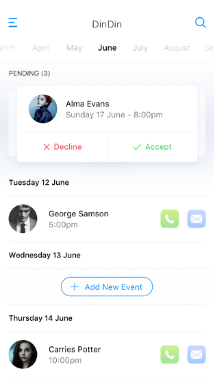

# Introduction

The purpose of this application is to allow people to schedule and attend dinners. The application is a react-native application that  shares common code base but run on both Android and IOS devices.

This was originally a school project but placed in GitHub for future development
